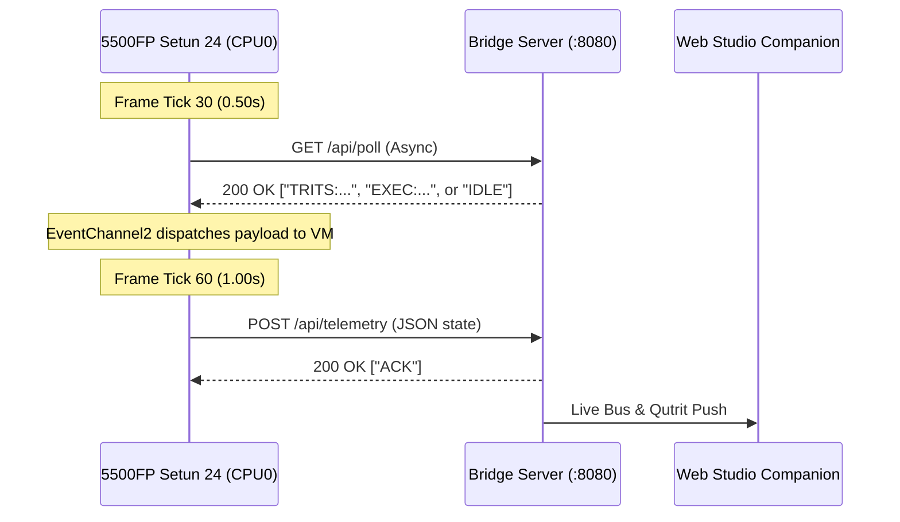

# 24-Trit Balanced Ternary Computer (5500FP Setun 24)
## Topological Co-Processor & EARTH Engine Specification

- **Target Platform**: Retro Gadgets (Lua 5.3 / 5.4 Engine)
- **Architecture Type**: 24-Trit Balanced Ternary Topological Emulation Layer

---

## 1. System Overview

The **5500FP Setun 24** is a hardware-emulated, 24-trit balanced ternary computer. Unlike traditional Von Neumann architectures, this system acts as a dedicated native processor for **EARTH Topological Mathematics**.

By utilizing balanced ternary logic, every ternary digit (**trit**) represents a topological twist state in a braid generator:

$$\text{State Value} \in \{-1, 0, +1\}$$

- **Left Twist ($-1$)**: Under-crossing ($\sigma^{-1}$). Visualized by **RED LEDs** (`color.red`).
- **Identity ($0$)**: No crossing ($I$). Visualized by **OFF LEDs** (`color.black` / inactive).
- **Right Twist ($+1$)**: Over-crossing ($\sigma$). Visualized by **GREEN LEDs** (`color.green`).

A standard 24-trit word physically represents a 24-step topological sequence (a **"Braid Word"**).

---

## 2. Hardware Manifest & Pinout

| Component | In-Game Identification | Role in Topological System |
|---|---|---|
| **CPU** | `CPU0` (Large CPU) | The EARTH Engine. Executes native topological simplification, B-ASM microcode, and braid logic. |
| **Triple-Rail Flash** | `FlashMemory0`, `1`, `2` | Triple-rail physical memory caching structural knot phases (Rail 0: Minus, Rail 1: Zero, Rail 2: Plus). |
| **ROM** | `ROM0` | Base bootstrap, fonts, and AudioSample storage. |
| **Video Chip** | `VideoChip0` (Double Buffer) | Renders topological phases, twist arrays, oscilloscope waveforms, and quantum qutrit bars. |
| **Networking** | `Wifi0` (Ch 2) | Bidirectional polling (`/api/poll`) and live telemetry POST (`/api/telemetry`). |
| **Trit Bus LEDs** | `Led0` to `Led23` (24x) | Physical 24-trit braid state visualization (2x12 array). |
| **Link Status LED** | `Led24` (Ch 10) | Cyan external server bridge connection status indicator. |
| **Magnetic Connector** | `MagneticConnector0` (Ch 11) | Modular hardware dock with mechanical snap chime and eject event handling. |
| **Center Macro Keys (3x)** | `LedButton0`, `LedButton1`, `LedButton2` (Ch 3, 4, 5) | 3 dedicated keys under the LEDs for manual trit insertion ($-1$, $0$, $+1$). |
| **Side Function Buttons (4x)**| `LedButton6`, `5`, `4`, `3` (Ch 9, 8, 7, 6) | 4 function buttons on the left for system & topological operations. |
| **Audio Output** | `Speaker0` | Physical acoustic output transducer on gadget front (`speaker.State = true`). |
| **Audio Processor** | `AudioChip0` | Multi-channel audio processor modulating sample pitch and volume. |

---

## 3. Physical Hardware Button Layout & Channel Routing

```text
       +--------------------+
       |   [PWR]     [ VideoChip0 ]            |
[Wifi0]|                                       |
 [Ch 9]|     [Led12... Led23] (High Bus)       |
 [Ch 8]|     [Led0 ... Led11] (Low Bus)        | [MagDock Ch 11]
 [Ch 7]|                                       |
 [Ch 6]|         [Ch 3]   [Ch 4]   [Ch 5]      |
       |          (-1)     (0)      (+1)       |
       +--------------------+
```

### 3 Center Macro Keys (Dedicated Trit Insertion)
| Key / Channel | Physical Location | Bound Action | Behavior |
|---|---|---|---|
| **`eventChannel3`** | Left Center Key | **Insert `-1`** | Shifts braid right and inserts an **under-crossing ($-1$, Red LED)**. |
| **`eventChannel4`** | Middle Center Key | **Insert `0`** | Shifts braid right and inserts an **identity state ($0$, Off LED)**. |
| **`eventChannel5`** | Right Center Key | **Insert `+1`** | Shifts braid right and inserts an **over-crossing ($+1$, Green LED)**. |

### 4 Left Side Function Buttons (Calibrated from Top to Bottom)
| Button / Channel | Physical Location | Bound Action | Behavior |
|---|---|---|---|
| **`eventChannel9`** | Top Side Button | **`B-SIMP` (Simplify)** | Scans ACC and annihilates adjacent $+1/-1$ pairs ($+1,-1 \to 0,0$). |
| **`eventChannel8`** | 2nd Side Button | **`B-INV` (Invert)** | Flips all $+1 \leftrightarrow -1$ across the 24 trits (mirrors chirality). |
| **`eventChannel7`** | 3rd Side Button | **`VIEW MEM / PEEK`** | Cycles flash address and **previews saved word on the 24 LEDs** for 1.5s. |
| **`eventChannel6`** | Bottom Side Button | **`SYNC` (Wifi Sync)** | Triggers immediate WiFi bridge sync with TPM triad chord. |

---

## 4. Workbench & Multitool Integration

- **Multitool Console**: Automatically logs colored ANSI execution traces (`log`, `logWarning`, `setFgColor`, `clear`).
- **Desk Minitool Pager**: Pushes notifications on quantum state changes, wave synthesis, and magnetic docking (`desk.ShowMessage`, `desk.ShowWarning`).
- **Desk Lamp Atmosphere**: Dynamically shifts ambient desk lighting color (`desk.SetLampColor`) between Cyan (Quantum), Gold (Soliton), and Red (Alert).
- **Dual-Highway Telemetry**: Regularly posts 24-trit bus and quantum register states via `Wifi0:WebPostData` to keep the Web Studio synchronized in real time.

---

## 5. Retro Gadgets WiFi Protocol & Dual-Highway Telemetry

### 5.1 Native Engine Constraints
- **REST Request/Response Model**: The Retro Gadgets engine does not support raw TCP sockets or persistent WebSockets. All external network I/O is asynchronous HTTP request-driven (`WebGet`, `WebPostData`, `WebPostForm`, `WebPutData`, `WebCustomRequest`).
- **Event-Driven Asynchronous Lifecycle**: Every web call returns an immediate numeric `RequestHandle`. When the external server responds, the CPU triggers `WifiWebResponseEvent` on **Channel 2** (`eventChannel2(sender, event)`).

### 5.2 Interleaved Dual-Highway Polling Schedule
To prevent buffer contention on the 60 Hz CPU loop, network requests are phase-shifted:



- **Inbound Command Highway (`GET /api/poll`)**:
  - Polled every 30 ticks ($0.5\text{ s}$).
  - Retrieves queued web UI actions (`TRITS:+++---...`, `EXEC:GATE H`, `TPM:GEN`).
- **Outbound Telemetry Highway (`POST /api/telemetry`)**:
  - Pushed every 60 ticks ($1.0\text{ s}$).
  - Delivers serialized JSON state: `{ "trits": "...", "mode": "...", "qProb": [...], "purity": 0.98, "netQ": 0, "docked": false }`.
- **Manual Hardware Override (`eventChannel6`)**:
  - Pressing the bottom side button (`SYNC`) immediately fires `wifi:WebGet("http://127.0.0.1:8080/api/poll")` without waiting for the timer cycle.

